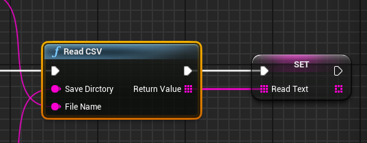
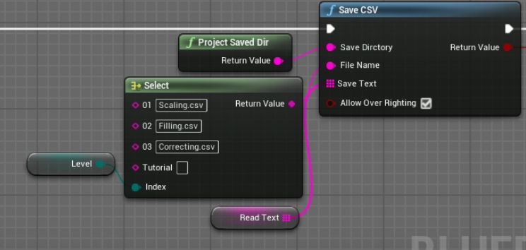
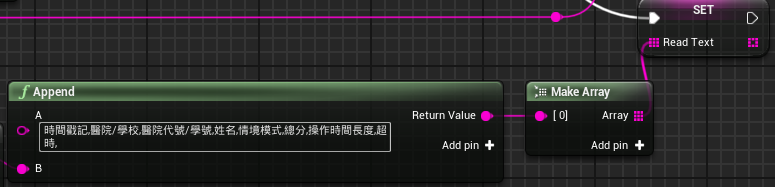

這是一個自定義的 C++ Blueprint Function Library，用於 Unreal Engine 中 CSV 檔案的讀取與儲存。

## 節點介紹
### 1. Read CSV
   

  - 功能：從指定路徑讀取 CSV 檔案。

  - 輸入：Save Directory (資料夾路徑), File Name (檔名)。

  - 輸出：Return Value (String Array)，每一行代表陣列中的一個元素。

### 3. Save CSV
   

  - 功能：將字串陣列寫入至 CSV 檔案。

  - 輸入 1：Save Text: 要存入的字串陣列。

  - 輸入 2：Allow Over Righting: 是否覆蓋原檔案。

### 3. Save使用方法：

  - 步驟 1：初始化與讀取

    - 使用 Read CSV 讀取現有的檔案。將結果存入一個變數。

  - 步驟 2：檢查與建立欄位

    - 若讀取到的陣列是空的，表示這是第一次輸出資料，第一行需要先 Append 一個包含欄位名稱的字串

  - 欄位範例：

    - 時間戳記, 醫院/學校, 醫院代碼/學號, 姓名, 情境模式, 總分, 操作時間長度, 超時

  - 步驟 3：新增一筆資料
    - 將新產生的每個欄位資料以逗號","分隔
    - 使用 Add 或 Make Array 將新列加入到原有的 Read Text 陣列中。

  - 步驟 4：存檔
    - "# UE-CSV-ReadWrite" 
